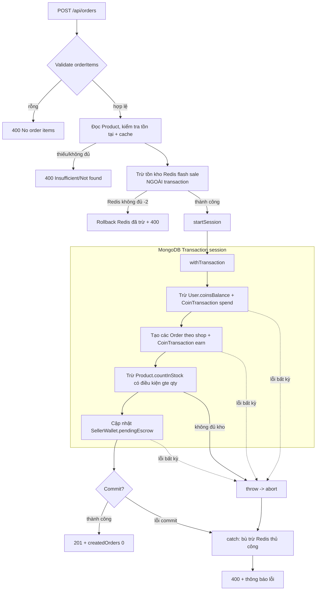
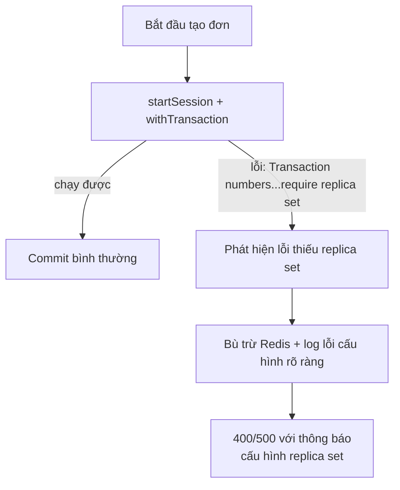

# Design Document

## Overview

Tài liệu này mô tả thiết kế kỹ thuật để bọc luồng tạo đơn hàng (`POST /api/orders` trong `backend-api/routes/orders.ts`) bằng một MongoDB multi-document transaction sử dụng Mongoose session và `session.withTransaction()`. Mục tiêu là đảm bảo **tính nguyên tử (atomicity)** cho tất cả thao tác ghi MongoDB của một lần đặt hàng, **chống race condition tồn kho** bằng trừ kho có điều kiện trong transaction, và **giữ Redis flash sale nhất quán** với kết quả MongoDB thông qua cơ chế bù trừ thủ công có kiểm soát cho riêng phần nằm ngoài transaction.

### Vấn đề với thiết kế hiện tại

Luồng hiện tại thực hiện các bước ghi tách rời và dựa vào `catch` block để bù trừ thủ công:

1. Kiểm tra tồn kho và cache `Product` (đọc).
2. Kiểm tra flash sale và trừ tồn kho Redis.
3. Nhóm item theo shop, tìm/ tạo Default Shop.
4. Lấy voucher, tính giảm giá (DiscountEngine), trừ `User.coinsBalance` + ghi `CoinTransaction` (spend).
5. Tạo nhiều `Order` (mỗi shop một document) + ghi `CoinTransaction` (earn, pending).
6. Trừ `Product.countInStock` có điều kiện (`$gte: qty`).
7. Cập nhật `SellerWallet.pendingEscrow`.

Hai vấn đề cốt lõi:

- **Khe hở race condition:** việc kiểm tra tồn kho (bước 1) tách rời khỏi lúc trừ tồn kho (bước 6). Giữa hai thời điểm này, một request khác có thể đã trừ kho.
- **Rollback thủ công dễ vỡ:** khi một bước thất bại, `catch` block chạy nhiều vòng lặp hoàn tác (hoàn Redis, hoàn coins, hoàn kho, xóa Order, giảm escrow). Nếu một bước hoàn tác lại thất bại, dữ liệu rơi vào trạng thái không nhất quán âm thầm.

### Giải pháp

Bọc các bước 4–7 (toàn bộ thao tác ghi MongoDB) trong một transaction duy nhất:

- Mọi lệnh `.save()`, `.create()`, `.findOneAndUpdate()`, `.deleteOne()` đều nhận `{ session }`.
- Trừ tồn kho có điều kiện được đưa **vào trong** transaction, loại bỏ khe hở race condition (kiểm tra và trừ kho diễn ra nguyên tử dưới sự cô lập của transaction).
- Khi bất kỳ thao tác nào ném lỗi, `withTransaction` tự động abort — không cần bất kỳ vòng lặp hoàn tác MongoDB nào.
- Trừ tồn kho Redis flash sale vẫn nằm **trước/ngoài** transaction (vì Redis không tham gia transaction MongoDB). Nếu transaction abort, ta bù trừ Redis thủ công trong `catch` — đây là cơ chế bù trừ thủ công **duy nhất** còn lại.

### Mục tiêu thiết kế

- Tính nguyên tử all-or-nothing cho mọi thao tác ghi MongoDB (Req 1).
- Không bao giờ để `countInStock` xuống dưới 0, kể cả khi đặt hàng đồng thời (Req 2).
- Redis flash sale luôn khớp với kết quả cuối cùng của transaction (Req 3).
- Loại bỏ hoàn toàn rollback thủ công MongoDB; giữ bù trừ thủ công chỉ cho Redis (Req 4).
- Hành vi xác định rõ ràng khi MongoDB không phải replica set (Req 5).
- Giữ tương đương hành vi API đối ngoại: 201/400, cấu trúc phản hồi, thông báo lỗi (Req 4.3).

## Architecture

### Luồng tổng quát (mới)



### Ranh giới transaction

| Thao tác | Trong transaction? | Cơ chế khi thất bại |
|----------|:------------------:|---------------------|
| Đọc/validate Product, flash sale | Không (đọc trước) | Trả 400 trực tiếp |
| Trừ tồn kho Redis flash sale | Không (Redis độc lập) | **Bù trừ thủ công** trong catch |
| Trừ `User.coinsBalance` + `CoinTransaction` (spend) | Có | Abort tự động |
| Tạo `Order` (nhiều document) + `CoinTransaction` (earn) | Có | Abort tự động |
| Trừ `Product.countInStock` (có điều kiện) | Có | Abort tự động |
| Cập nhật `SellerWallet.pendingEscrow` | Có | Abort tự động |

Nguyên tắc: tất cả thao tác MongoDB ghi đều nằm trong transaction; Redis là hệ thống ngoài nên phải tự bù trừ.

### Thứ tự thao tác trong transaction

Trừ tồn kho `Product` được di chuyển vào trong transaction (trước đây là bước 6 sau khi tạo Order). Trong transaction, thứ tự đề xuất:

1. Trừ coins + ghi `CoinTransaction` spend (nếu có redeem).
2. Tạo các `Order` + `CoinTransaction` earn (pending) cho từng shop.
3. Trừ `Product.countInStock` có điều kiện cho mọi item; nếu một item không đủ → `throw` → abort.
4. Cập nhật `SellerWallet.pendingEscrow` cho từng order.

Việc đặt trừ tồn kho có điều kiện trong cùng transaction đảm bảo kiểm tra-và-trừ là nguyên tử: dưới snapshot isolation của MongoDB, nếu hai transaction cùng trừ một sản phẩm, một trong hai sẽ gặp xung đột ghi (write conflict) và được `withTransaction` thử lại; lần thử lại sẽ thấy tồn kho đã cập nhật và bộ lọc `countInStock >= qty` sẽ ngăn việc bán âm.

### Xử lý ràng buộc replica set (Req 5)

MongoDB transaction yêu cầu replica set. Phương án được chọn: **thử transaction và báo lỗi cấu hình rõ ràng nếu môi trường không hỗ trợ** — KHÔNG âm thầm rơi vào đường ghi không nhất quán.



Cơ chế phát hiện: bắt lỗi từ `withTransaction` và kiểm tra dấu hiệu lỗi của MongoDB khi chạy single-node, ví dụ:

- `IllegalOperation: Transaction numbers are only allowed on a replica set member or mongos` (codeName `IllegalOperation`, hoặc thông điệp chứa "replica set member or mongos").
- Lỗi mang `errorLabels` chứa `TransientTransactionError` không tự khắc phục được.

Khi phát hiện đúng dấu hiệu thiếu replica set, hệ thống trả lỗi cấu hình rõ ràng (thông báo nêu yêu cầu replica set) và ghi log cảnh báo cấu hình, thay vì thử ghi theo đường không transaction. Nhờ vậy không có dữ liệu nửa vời được tạo ra.

**Cập nhật môi trường dev (docker-compose):** chuyển service `mongodb` sang chạy chế độ replica set một node để dev/test dùng được transaction:

```yaml
  mongodb:
    image: mongo:latest
    command: ["mongod", "--replSet", "rs0", "--bind_ip_all"]
    ports:
      - "27017:27017"
    volumes:
      - mongo_data:/data/db
    healthcheck:
      test: >
        mongosh --quiet --eval "try { rs.status().ok } catch (e) { rs.initiate({_id:'rs0',members:[{_id:0,host:'mongodb:27017'}]}).ok }"
      interval: 10s
      start_period: 30s
      retries: 5
```

Và `MONGO_URI` của `backend-api` cập nhật thành `mongodb://mongodb:27017/stuffy_db?replicaSet=rs0`. Với dev local ngoài Docker, khởi chạy `mongod --replSet rs0` rồi `rs.initiate()` một lần. Ghi nhận ràng buộc này trong `.env.example` và tài liệu vận hành.

## Components and Interfaces

### Thành phần thay đổi

Toàn bộ thay đổi tập trung trong một handler: `router.post('/')` của `backend-api/routes/orders.ts`. Không thay đổi model, không thay đổi `DiscountEngine`, `LogisticsService`, `RedisInventoryService` (chỉ thay đổi cách gọi).

### Mongoose session / transaction

Sử dụng API có sẵn của Mongoose 8:

```typescript
const session = await mongoose.startSession();
try {
  let createdOrders: any[] = [];
  await session.withTransaction(async () => {
    // reset trạng thái mỗi lần thử lại (withTransaction có thể retry)
    createdOrders = [];

    // (1) trừ coins
    if (coinsToRedeem > 0) {
      await User.findByIdAndUpdate(req.user._id,
        { $inc: { coinsBalance: -coinsToRedeem } }, { session });
      await CoinTransaction.create([{ /* ... */ }], { session });
    }

    // (2) tạo orders theo shop
    for (const [shopIdStr, items] of shopGroupsMap.entries()) {
      const order = new Order({ /* ... */ });
      const savedOrder = await order.save({ session });
      createdOrders.push(savedOrder);
      if (coinsEarned > 0) {
        await CoinTransaction.create([{ /* ... */ orderId: savedOrder._id }], { session });
      }
    }

    // (3) trừ tồn kho có điều kiện
    for (const item of orderItems) {
      const qty = item.qty || 1;
      const result = await Product.findOneAndUpdate(
        { _id: item.product, countInStock: { $gte: qty } },
        { $inc: { countInStock: -qty } },
        { session, new: true }
      );
      if (!result) {
        throw new InsufficientStockError(item.product);
      }
    }

    // (4) cập nhật ví escrow
    for (const savedOrder of createdOrders) {
      const wallet = await SellerWallet.findOneAndUpdate(
        { shopId: savedOrder.shop },
        { $inc: { pendingEscrow: savedOrder.totalPrice } },
        { session, new: true, upsert: true }
      );
    }
  });

  res.status(201).json(createdOrders[0]);
} catch (error) {
  // bù trừ Redis thủ công + map lỗi -> HTTP
} finally {
  await session.endSession();
}
```

Lưu ý kỹ thuật quan trọng:

- **`Model.create([...], { session })`** phải nhận mảng để truyền options session đúng cách (đây là API Mongoose). `new Doc().save({ session })` cũng hợp lệ.
- **Idempotent retry:** `withTransaction` có thể chạy lại callback khi gặp `TransientTransactionError`. Mọi biến tích lũy trạng thái (như `createdOrders`) phải được **reset ở đầu callback**, và callback không được gây side-effect ngoài MongoDB (việc trừ Redis phải nằm ngoài callback).
- **Tính phí ship/`DiscountEngine`** là tính toán thuần (đọc dữ liệu + tính), có thể chuẩn bị **trước** transaction để callback ngắn gọn và an toàn khi retry. Các truy vấn đọc bổ trợ (Promotion, Shop) nên thực hiện trước transaction; nếu cần đọc trong transaction thì truyền `{ session }`.

### Phối hợp Redis (ngoài transaction)

Thứ tự (giữ tương đương luồng hiện tại):

1. Trừ Redis flash sale **trước** khi mở transaction. Nếu Redis trả `-2` (không đủ) → hoàn lại các phần đã trừ trong request và trả 400 **trước khi** chạm vào MongoDB (Req 3.4).
2. Mở transaction và thực hiện ghi MongoDB.
3. Nếu transaction **abort/throw** sau khi đã trừ Redis → trong `catch`, gọi `RedisInventoryService.rollbackInventory(...)` cho từng phần đã trừ (Req 3.2). Nếu rollback Redis lỗi → chỉ log, không làm hỏng phản hồi (Req 3.3).

### Phân loại và ánh xạ lỗi → HTTP

| Tình huống | HTTP | Thông báo |
|-----------|:----:|-----------|
| `orderItems` rỗng | 400 | `No order items` |
| Product không tồn tại | 400 | `Product {id} not found` |
| Không đủ kho (đọc trước) | 400 | `Insufficient stock for {name}. Available: {n}` |
| Redis flash sale không đủ | 400 | `Insufficient stock for Flash Sale product: {name}` |
| Voucher livestream-only | 400 | (giữ nguyên thông báo hiện tại) |
| Không đủ kho khi trừ trong transaction | 400 | `Stock depleted for product {id} during order processing.` |
| Thiếu replica set | 400/500 | Thông báo cấu hình replica set rõ ràng |
| Lỗi khác | 400 | `error.message` hoặc `Server error creating order` |

Giữ nguyên: thành công trả **201** với `createdOrders[0]` (document order đầu tiên).

## Data Models

Không thay đổi schema. Các model tham gia transaction:

- **Order:** nhiều document/đơn (một per shop group), gắn `parentOrderId` chung. Ghi qua `.save({ session })`.
- **Product:** trường `countInStock` được trừ có điều kiện qua `findOneAndUpdate({ _id, countInStock: { $gte: qty } }, { $inc: { countInStock: -qty } }, { session })`.
- **User:** trường `coinsBalance` trừ qua `$inc` với `{ session }`.
- **CoinTransaction:** bản ghi `spend` (khi redeem) và `earn` (pending, gắn `orderId`), tạo qua `create([...], { session })`.
- **SellerWallet:** trường `pendingEscrow` tăng qua `$inc` với `{ session, upsert: true }`. (Chuyển từ đọc-sửa-ghi sang `findOneAndUpdate $inc` để an toàn cạnh tranh và gọn trong transaction.)

Các bất biến dữ liệu (data invariants):

- `Product.countInStock >= 0` tại mọi thời điểm sau commit.
- Tổng `pendingEscrow` tăng đúng bằng tổng `totalPrice` của các order được tạo trong một lần đặt thành công.
- `User.coinsBalance` giảm đúng `coinsToRedeem` khi và chỉ khi đơn được commit.
- Nếu transaction abort: không tồn tại `Order`, `CoinTransaction`, thay đổi `countInStock`, `coinsBalance`, `pendingEscrow` nào từ request đó.

## Correctness Properties

*Một property (thuộc tính) là một đặc điểm hoặc hành vi phải luôn đúng trên mọi lần thực thi hợp lệ của hệ thống — về bản chất là một phát biểu hình thức về điều hệ thống phải làm. Properties là cầu nối giữa đặc tả dễ đọc cho con người và các bảo đảm đúng đắn kiểm chứng được bằng máy.*

Các acceptance criteria mang tính cơ chế/cấu trúc (1.1 "một transaction duy nhất", 2.1 "trừ có điều kiện", 4.1/4.2 "loại bỏ rollback thủ công") được kiểm chứng gián tiếp qua hệ quả hành vi của chúng, nên không tạo property riêng. Các criteria về môi trường/tài liệu (5.1, 5.3) và logging (3.3) không phù hợp PBT — xem Testing Strategy. Các criteria 6.1/6.2/6.3 chính là yêu cầu hiện thực các property P2/P4/P5 dưới đây.

### Property 1: Đường thành công áp dụng nhất quán mọi thay đổi

*For any* giỏ hàng hợp lệ (mọi sản phẩm còn đủ kho cho qty yêu cầu, coins redeem nằm trong giới hạn), khi tạo đơn thành công thì hệ thống trả HTTP 201 và áp dụng đồng thời mọi thay đổi nhất quán: số `Order` được tạo bằng số shop group, mỗi `Product.countInStock` giảm đúng tổng qty đã đặt, tổng `SellerWallet.pendingEscrow` tăng đúng tổng `totalPrice` của các order, và `User.coinsBalance` giảm đúng `coinsToRedeem`.

**Validates: Requirements 1.1, 1.2**

### Property 2: Tính nguyên tử khi abort

*For any* giỏ hàng và bất kỳ điểm thất bại nào trong các thao tác ghi MongoDB của luồng tạo đơn, khi transaction bị abort thì trạng thái MongoDB sau request bằng đúng trạng thái trước request (không `Order`, `CoinTransaction`, thay đổi `countInStock`, `coinsBalance`, hay `pendingEscrow` nào tồn tại lại), và hệ thống trả HTTP 400 kèm thông báo lỗi mô tả nguyên nhân.

**Validates: Requirements 1.3, 1.4**

### Property 3: Từ chối khi thiếu kho ở bước trừ trong transaction

*For any* giỏ hàng trong đó ít nhất một sản phẩm có `qty` lớn hơn `countInStock` tại thời điểm trừ kho, hệ thống abort transaction và trả HTTP 400 nêu rõ sản phẩm thiếu hàng, đồng thời không tạo `Order` nào và không thay đổi `countInStock` của bất kỳ sản phẩm nào.

**Validates: Requirements 2.2**

### Property 4: An toàn cạnh tranh — không bán âm tồn kho

*For any* tồn kho ban đầu `N` của một sản phẩm và bất kỳ số lượng `k` request đặt hàng đồng thời mỗi request mua `qty`, số đơn thành công không vượt quá `floor(N / qty)`, `countInStock` cuối cùng luôn `>= 0`, và `countInStock` cuối bằng `N - (số đơn thành công × qty)`.

**Validates: Requirements 2.3**

### Property 5: Nhất quán Redis–MongoDB khi abort

*For any* sản phẩm flash sale với tồn kho Redis ban đầu `S` và bất kỳ kịch bản nào khiến transaction MongoDB abort sau khi đã trừ tồn kho Redis, tồn kho flash sale trên Redis sau request được hoàn về đúng giá trị ban đầu `S`.

**Validates: Requirements 3.2, 4.2**

### Property 6: Từ chối trước commit khi Redis flash sale không đủ

*For any* yêu cầu mua sản phẩm flash sale với `qty` lớn hơn tồn kho Redis hiện có, hệ thống trả HTTP 400 trước khi commit transaction MongoDB, và không có thao tác ghi MongoDB nào (Order, kho, ví, coins) được tạo ra từ request đó.

**Validates: Requirements 3.4**

## Error Handling

### Nguyên tắc

- **Lỗi trong transaction:** mọi lỗi ghi MongoDB được ném ra trong callback của `withTransaction` sẽ kích hoạt abort tự động. Không bắt-rồi-nuốt lỗi bên trong callback; để lỗi lan ra để transaction abort đúng.
- **Lỗi nghiệp vụ tường minh:** thiếu kho khi trừ trong transaction ném `InsufficientStockError` (hoặc `Error` với thông điệp rõ ràng) để abort và map sang 400.
- **Phân biệt lỗi cấu hình:** sau khi `withTransaction` thất bại, phân loại lỗi:
  - Nếu là dấu hiệu thiếu replica set (codeName `IllegalOperation` / thông điệp chứa "replica set member or mongos") → trả lỗi cấu hình rõ ràng, log cảnh báo vận hành.
  - Nếu là lỗi nghiệp vụ (thiếu kho, voucher...) → 400 với thông báo tương ứng.
  - Lỗi khác → 400 với `error.message` hoặc `Server error creating order` (giữ tương đương hiện tại).

### Bù trừ Redis trong catch

```typescript
} catch (error: any) {
  // Bù trừ thủ công CHỈ cho Redis (thao tác ngoài transaction)
  for (const dec of redisDecremented) {
    try {
      await RedisInventoryService.rollbackInventory(dec.promotionId, dec.productId, dec.qty);
    } catch (rollbackErr: any) {
      // Req 3.3: log, không làm hỏng phản hồi
      console.error(`[Orders] Failed to restore Redis stock for ${dec.productId}:`, rollbackErr.message);
    }
  }
  // KHÔNG còn hoàn kho/coins/xóa Order cho MongoDB — transaction đã tự abort (Req 4.1)
  res.status(mapStatus(error)).json({ error: error.message || 'Server error creating order' });
} finally {
  await session.endSession();
}
```

Điểm khác biệt mấu chốt so với hiện tại: `catch` không còn các vòng lặp hoàn kho MongoDB, hoàn coins, xóa Order, giảm escrow. Toàn bộ đã được transaction abort xử lý nguyên tử.

### An toàn khi retry của `withTransaction`

`withTransaction` có thể chạy lại callback khi gặp `TransientTransactionError` hoặc xung đột ghi. Để retry an toàn:

- Callback chỉ chứa thao tác MongoDB (idempotent khi chạy lại trong transaction mới).
- Reset biến tích lũy (`createdOrders`) ở đầu callback.
- KHÔNG đặt lệnh Redis hoặc side-effect ngoài MongoDB bên trong callback (trừ Redis nằm trước transaction).

## Testing Strategy

### Cách tiếp cận kép

- **Property-based tests:** kiểm chứng các property phổ quát P1–P6 (atomicity, không bán âm, nhất quán Redis-Mongo, các cổng từ chối) trên nhiều input sinh ngẫu nhiên.
- **Unit/example tests:** kiểm chứng tương đương hợp đồng API và các nhánh xử lý lỗi cụ thể.
- **Integration/smoke tests:** kiểm chứng tích hợp Redis và ràng buộc môi trường replica set.

### Hạ tầng test

Hiện repo chưa có test framework cài đặt (chỉ có các script `test-*.ts` chạy bằng `ts-node`). Đề xuất:

- Thêm test runner: **Jest** (hoặc Vitest) với `ts-jest`/transpile để chạy TypeScript.
- Thêm thư viện property-based testing: **fast-check** (chuẩn cho hệ sinh thái JS/TS). KHÔNG tự hiện thực PBT từ đầu.
- MongoDB cho test: chạy **replica set một node** (mongo container với `--replSet rs0` + `rs.initiate`) để transaction hoạt động. Có thể dùng `mongodb-memory-server` ở chế độ replica set cho test cô lập.
- Redis: container `redis:alpine` hoặc mock `RedisInventoryService` cho test logic.

### Cấu hình property test

- Mỗi property test chạy **tối thiểu 100 iteration** (fast-check mặc định cấu hình `numRuns: 100`).
- Mỗi property test gắn comment tham chiếu property thiết kế theo định dạng:
  `// Feature: transactional-order-creation, Property {number}: {property_text}`
- Mỗi property trong P1–P6 được hiện thực bằng **một** property test tương ứng.

Ánh xạ property → test:

| Property | Trọng tâm test | Generators |
|----------|----------------|-----------|
| P1 | Đường thành công áp dụng nhất quán | Giỏ hàng hợp lệ: số shop, số item, qty ≤ kho, coins ≤ giới hạn |
| P2 | Atomicity khi abort | Giỏ hàng + điểm thất bại (item vượt kho ở bước trừ / mock lỗi ghi ví) |
| P3 | Từ chối thiếu kho trong transaction | Giỏ hàng có ≥1 item qty > countInStock |
| P4 | An toàn cạnh tranh | Kho `N`, số request đồng thời `k`, `qty` — chạy `Promise.all` |
| P5 | Nhất quán Redis-Mongo | Redis stock `S`, giỏ flash sale + kịch bản abort Mongo |
| P6 | Từ chối khi Redis thiếu | Redis stock < qty yêu cầu |

### Unit/example tests (tương đương hợp đồng API — Req 4.3)

- Tạo đơn thành công: 201 + body là document order đầu tiên với `status: "Pending"`, kho giảm đúng qty.
- Giỏ rỗng: 400 `No order items`.
- Product không tồn tại: 400 `Product {id} not found`.
- Voucher livestream-only không từ livestream: 400 (giữ nguyên thông báo).
- Redis rollback thất bại (mock `rollbackInventory` ném lỗi): handler vẫn trả 400, không crash (Req 3.3).

### Edge-case / integration / smoke tests

- **Edge-case (Req 5.2):** mô phỏng môi trường single-node (hoặc mock `withTransaction` ném lỗi thiếu replica set) → xác nhận trả lỗi cấu hình rõ ràng và KHÔNG có ghi MongoDB nửa vời nào tồn tại.
- **Integration (Req 3.1):** đặt mua sản phẩm flash sale active → xác nhận `RedisInventoryService.decrementInventory` được gọi và Redis stock giảm đúng qty.
- **Smoke (Req 5.1, 5.3):** môi trường test boot với mongo replica set; kiểm tra `docker-compose.yml` và `.env.example` đã ghi nhận ràng buộc `replicaSet=rs0`.

### Lý do một số tiêu chí không dùng PBT

- 3.3 (logging khi rollback Redis lỗi): thao tác side-effect, không có giá trị trả để khẳng định phổ quát → dùng mock-based example test.
- 4.1/4.3 (cấu trúc mã, tương đương hợp đồng): kiểm chứng bằng review + example test.
- 5.1/5.3 (môi trường, tài liệu): cấu hình hạ tầng → smoke test/kiểm tra cấu hình.
- 5.2 (single-node): khó dựng nhiều iteration có ý nghĩa, là một điều kiện biên xác định → edge-case test.
